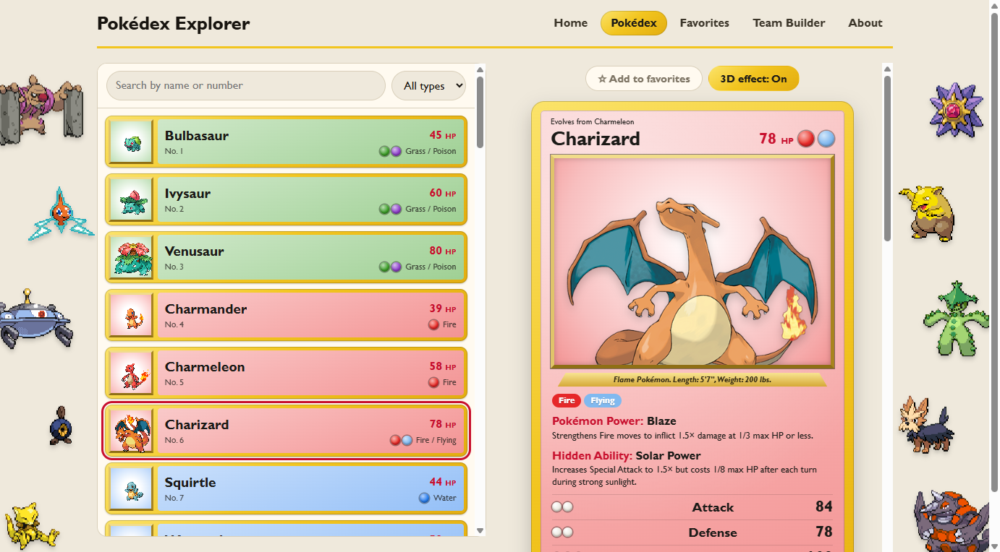

# Pokédex Explorer

Browse all 649 Pokémon from Generations 1–5, styled like the original Pokémon trading cards.

**Live site: https://illyy1.github.io/pokedex-explorer/**



## Features

- **Pokédex:** search by name or number, filter by type, and scroll through every Pokémon (more load as you reach the end). Each Pokémon opens as a trading card with its stats, abilities, weaknesses, Pokédex entry and Smogon's competitive builds. Legendary and mythical Pokémon get a sparkly rainbow card, and cards tilt in 3D under the mouse, or as you tilt your phone (you can turn this off).
- **Favorites:** star Pokémon to collect them on their own page.
- **Team Builder:** build as many teams of six as you like. Choose each Pokémon's item, ability, nature, EVs and four moves, fill everything in from one of its Smogon builds, or randomize the whole team or one Pokémon at a time. **Export to Showdown** copies the team so you can paste it into [Pokémon Showdown](https://play.pokemonshowdown.com/).
- **Home:** a Pokémon of the day. Every page has random Pokémon sprites peeking in from the edges of the screen.

Favorites and teams are saved in your browser (localStorage). There is no account and no server.

## Built with

- [React](https://react.dev) 19, [TypeScript](https://www.typescriptlang.org) and [Vite](https://vite.dev)
- [React Router](https://reactrouter.com) for the pages
- [oxlint](https://oxc.rs) for linting
- Plain CSS, no UI library

## Data

- **[PokéAPI](https://pokeapi.co):** names, pictures, types, stats, abilities, moves, weaknesses and Pokédex entries.
- **[Smogon](https://www.smogon.com):** Generation 5 competitive builds and items, downloaded from the [pkmn project](https://data.pkmn.cc).

Both are free and need no API key.

## Run it yourself

You need [Node.js](https://nodejs.org) 22 or newer.

```bash
git clone https://github.com/illyy1/pokedex-explorer.git
cd pokedex-explorer
npm install
npm run dev
```

Then open http://localhost:5173.

| Command | What it does |
| --- | --- |
| `npm run dev` | Starts the development server |
| `npm run build` | Type-checks and builds the site into `dist/` |
| `npm run lint` | Checks the code with oxlint |
| `npm run preview` | Serves the built site locally |

Every push to `main` is linted, built and published to GitHub Pages by [a GitHub Actions workflow](.github/workflows/deploy.yml).

## How it was planned

This is a first-year student project, built step by step with an AI coding assistant:

- [PRD.md](PRD.md): what the app does and for whom, its pages and its acceptance criteria.
- [tasks.md](tasks.md): the build order, one commit per task, each with a "Done when" check.
- [prompts.md](prompts.md): every prompt given to the assistant, in order.

## Disclaimer

Fan project, not affiliated with or endorsed by Nintendo, Game Freak, Creatures or The Pokémon Company. Pokémon and Pokémon character names are trademarks of their respective owners.
